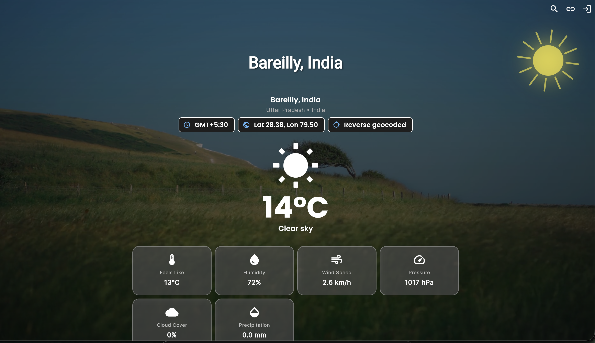
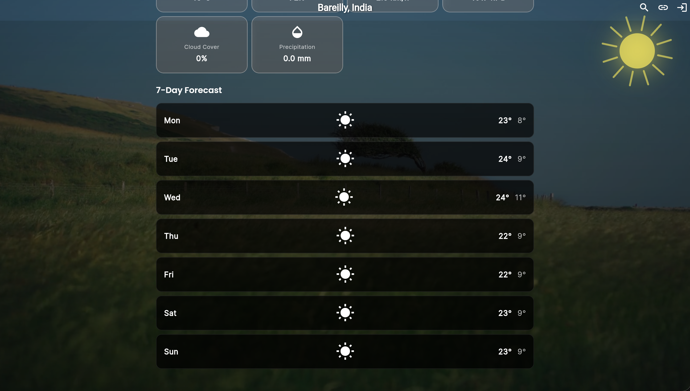

# Weather App (Cloudflare Workers + Flutter)

A full-stack weather experience powered by a Cloudflare Workers backend and a Flutter frontend. The project combines a secure, cache-aware API with a smooth client that uses location services, manual fallback, city search, and deep linking.

## Contents
- [Architecture Overview](#architecture-overview)
- [Key Features](#key-features)
- [Project Structure](#project-structure)
- [Backend Setup](#backend-setup)
- [Frontend Setup](#frontend-setup)
- [API Highlights](#api-highlights)
- [Deep Linking & City Search Flow](#deep-linking--city-search-flow)
- [Testing](#testing)
- [UI Screenshots](#ui-screenshots)

## Architecture Overview
- **Backend**: Cloudflare Workers (Hono.js) + D1 (SQLite) + Workers KV for caching. The worker exposes REST endpoints for authentication, user profile, and weather retrieval backed by the Open-Meteo APIs. Weather responses are cached and rate-limited by tier.
- **Frontend**: Flutter app targeting mobile, desktop, and web. It talks directly to the worker, handles location permissions, supports manual coordinate entry, city search, and deep link launches.
- **Shared Concepts**: The frontend generates SHA256 request hashes that the backend uses as cache keys. Both sides understand a `WeatherQuery` model (lat/lon or city) and surface normalized location metadata (city/state/country) produced by the backend's forward/reverse geocoding flow.

## Key Features
### Backend
- Hono routing with modular controllers, middlewares (CORS, logging, auth, rate limiting).
- JWT-based auth (register/login/me) backed by Cloudflare D1.
- Weather endpoints (forecast + historical) that call Open-Meteo, append reverse-geocoded location info (geocode.maps), and cache results in KV.
- Tiered rate limiting (100/min IP unauth, 1000/min user auth) enforced in KV.
- Consistent response envelope with success/error metadata and cache flags.
- Vitest coverage for services/utilities + Wrangler config ready for deployment.

### Frontend
- Cross-platform Flutter experience with BLoC state management.
- Splash screen that tries GPS, falls back to manual entry, or honors deep links before showing weather.
- Weather screen with parallax backgrounds, animation helpers, current + hourly + daily breakdowns, and shareable deep links.
- City search dialog, manual coordinate entry with validation, and cached data fallback on errors.
- Deep link handling on Android/iOS (intent filters/URL schemes) and web (query-based) without route jumps.
- Dependency injection via `get_it`, network via Dio, secure storage, Hive caching hooks (ready for expansion).

## Project Structure
```
weather_app/
├── backend/weather-backend      # Cloudflare Worker (TypeScript)
└── frontend/weather_app         # Flutter client
```
Refer to `backend/weather-backend/README.md` and `frontend/weather_app/README.md` for deeper subsystem docs.

## Backend Setup
1. **Prereqs**: Node.js 18+, Wrangler CLI, npm.
2. **Install**: `cd backend/weather-backend && npm install`
3. **Config Secrets**:
   - `cp .dev.vars.example .dev.vars` and fill `JWT_SECRET`, optional geocode key.
   - `.env.example` documents Cloudflare bindings if you need local overrides.
4. **Run locally**: `npm run dev` (Wrangler dev server). Default endpoints at `http://localhost:8787`.
5. **Tests**: `npm test` (Vitest)
6. **Deploy**: `npm run deploy` once your Cloudflare account/bindings are configured.

## Frontend Setup
1. **Prereqs**: Flutter SDK >= 3.10, Dart >= 3.0.
2. **Install deps**: `cd frontend/weather_app && flutter pub get`
3. **Run**: `flutter run` (choose device or `-d chrome` for web).
4. **Tests**: `flutter test`
5. **Deep link testing**:
   - Android: `adb shell am start -a android.intent.action.VIEW -d "weatherapp://weather?city=Berlin" your.package.id`
   - iOS Simulator: `xcrun simctl openurl booted "weatherapp://weather?lat=37.7749&lon=-122.4194"`
   - Web: append `?city=Berlin` or `?lat=..&lon=..` to the dev-server URL.

## API Highlights
Base path: `/api/v1`
- `POST /auth/register`, `POST /auth/login`, `GET /auth/me`
- `GET /weather/forecast` – accepts `lat/lon` or `city`, optional unit/timezone params, requires `hash`.
- `GET /weather/historical` – similar query params plus `start_date/end_date`.
- Responses include `data.location` with normalized city metadata, `meta.cached` flag, and rate-limit headers.

## Deep Linking & City Search Flow
1. Deep link arrives (mobile intent, universal link, or web query).
2. App shell records the `WeatherQuery` in `DeepLinkTracker`.
3. Splash screen waits for the tracker before attempting GPS; `WeatherScreen` listens for the new query and refreshes in place.
4. If the requested location fails, the app falls back to the device's current location and resumes the normal flow.
5. Users can also tap the search icon to change cities, which updates the browser URL (on web) and share link.

## Testing
- **Backend**: `npm test` (Vitest) covers weather service, caching, hashing, response utils.
- **Frontend**: `flutter test` currently houses widget smoke tests; run `dart analyze` for static checks.
- Additional manual checks: `npm run dev` (backend) + `flutter run -d chrome` (frontend) to validate deep linking and rate limiting.

## Next Steps
- Replace `print` statements with a logging abstraction.
- Address deprecated Flutter APIs (`withOpacity`, `desiredAccuracy`).
- Expand automated widget/integration tests for location + deep-link scenarios.

## UI Screenshots

| Splash & Manual Entry | Weather Overview | Detailed Forecast |
| --- | --- | --- |
|  |  |  |
